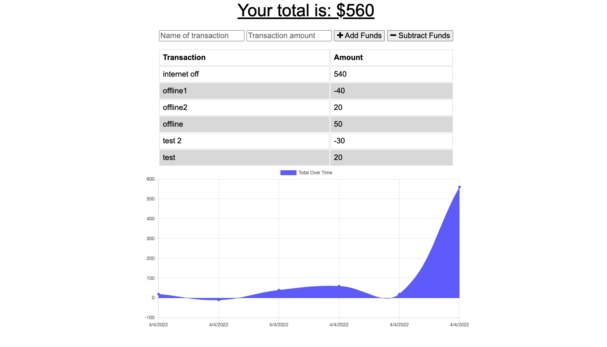

<h1 align="center">Hello! I'm Daniel Kim</h1>
<h2 align="center">Challenge #19: Progressive Web Applications (PWA) - Budget Chaser</h2>

### 👨‍💻This project repo can be found at https://github.com/danielkim13/dk_proj_budget_chaser/

### 📫How to reach me **daniel.d.kim13@gmail.com**

#### Previous GW Boot Camp Assignments:

    - Challenge #1: Horiseon Front Page Refactor (HTML, CSS)
    - Challenge #2: Personal Portfolio (HTML, CSS)
    - Challenge #3: Password Generator (HTML, CSS, JS)
    - Challenge #4: JavaScript Quiz (HTML, CSS, JS, DOM)
    - Challenge #5: Work Day Scheduler (HTML, CSS, JS, DOM, Bootstrap, jQuery, jQueryUI, Moment)
    - Challenge #6: Weather Dashboard (HTML, CSS, JS, DOM, jQuery, Ajax, Server-side API)
    - Project #1: CityGirl Project (HTML, Bulma CSS Framework, DOM, JS, Ajax, Server-side API )
    - Challenge #9: README generator (markdown, node.js, inquirer npm)
    - Challenge #10: OOP - Team Profile Generator (node.js, npm: inquirer, jest)
    - Challenge #11: Express.js - Note taker (node.js, express.js, heroku)
    - Challenge #12: mySQL - Employee Tracker (node.js, mySQL, various NPMs)
    - Challenge #13: ORM - E Commerce back end (node.js, mySql, various NPMs)
    - Challenge #14: MVC - Tech Blog (node.js, mySql, Sequelize.js, handlebars.js, various NPMs)
    - Project #2: WAG Project(HTML, CSS, Bulma, DOM, Ajax, Node.js, handlebars.js, mySql, Sequelize.js, various NPMs)
    - Challenge #17: Regex tutorial Git gist
    - Challenge #18: NoSQL - Social Network API (mongodb, mongoose, node.js, various NPMs)

<h2 align="center"><b>About the Project</b></h4>

The project is enhancing an existing budget tracker application to allow for offline access and functionality.

## Installation

      npm i

<h4><u>User Story</u></h4>

AS AN avid traveler
I WANT to be able to track my withdrawals and deposits with or without a data/internet connection
SO THAT my account balance is accurate when I am traveling 

<h4><u>Acceptance Criteria</u></h4>

<b>GIVEN a budget tracker without an internet connection</b>

    - #1: WHEN the user inputs an expense or deposit
          THEN they will receive a notification that they have added an expense or deposit

    - #2: WHEN the user reestablishes an internet connection
          THEN the deposits or expenses added while they were offline are added to their transaction history and their totals are updated

## Screen Capture

